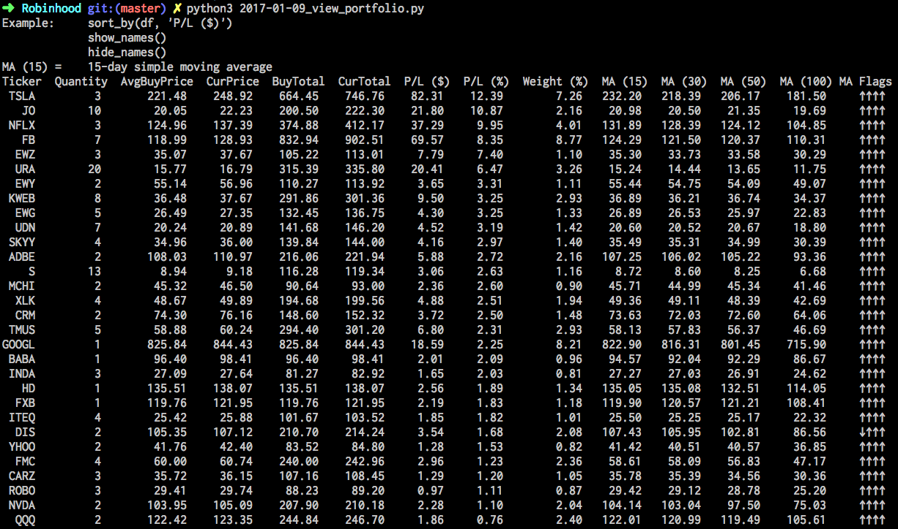

# Robin-Folios

* Example programs for barebones, "quick and dirty" automated trading and portfolio management with the Robinhood broker API.
* This project is meant to show how anyone with a bit of programming knowledge these days can try out and explore simple algorithmic trading strategies, using available online resources, at no cost.
* Original "Robinhood.py" library courtesy of https://github.com/MeheLLC/Robinhood

### Automated Trading
* background.py contains an example implementation of a premarket gainer momentum-based strategy. The strategy shown can be run in the background and will fetch top premarket gainers from the specified websites, place orders for those gainers, and close those positions the next day.

### View Portfolio
* view_portfolio.py contains code for a comprehensive and interactive view of your Robinhood portfolio, including:
  + Average buy prices
  + Quantities
  + Current prices and totals
  + Security names
  + 15/30/50/100-day Simple Moving Averages (MA)
  + Flags for current price being above/below those MA's
  + Portfolio weights ($/%)
  + Unrealized Profits/Losses ($/%)
  + Sorting by attributes
  + and more
